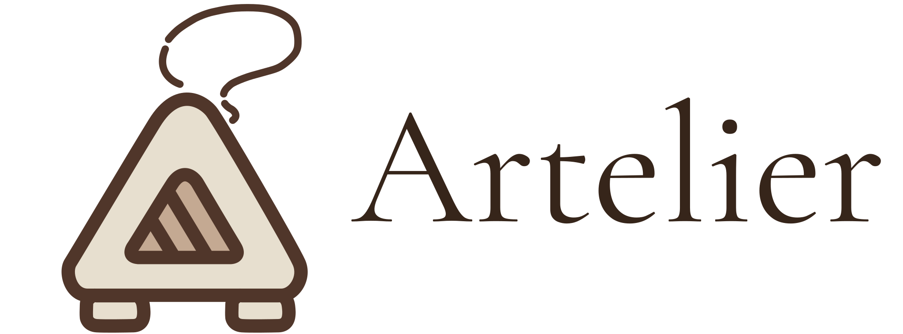

<a id="top"></a>

<p align="center">
  
</p>

<p align="center">
  
  
  
  
  
  
  
  
  
</p>

<p align="center">
  <b>Web storefront for Artelier Cajicá — an e-commerce platform for handmade ceramic and wood art.</b><br/>
  Built with Next.js · React · TypeScript · Tailwind CSS · shadcn/ui · Zustand
</p>

---

## Table of Contents

- [About the Project](#-about-the-project)
- [Tech Stack](#-stack-frontend)
- [Architecture Overview](#-architecture-overview)
- [Project Status](#-project-status)
- [Testing & Quality](#-testing--quality)
- [Getting Started](#-getting-started)
- [Environment Variables](#-environment-variables)
- [CI/CD](#-cicd)
- [Deploy](#-deployment--infrastructure)
- [Contributing](#-contributing)
- [Author](#-author)

---

## 🎨 About the Project

**Artelier Cajicá** is a real handmade art brand based in Cajicá, Colombia. The brand sells
one-of-a-kind ceramic and wood sculptures — each piece hand-painted, some made entirely from
scratch using clay.

Up until now, sales have been mostly word-of-mouth. The artist has an Instagram account
([@arteliercajica](https://www.instagram.com/arteliercajica)) with 109 posts but limited reach.
This repository is the **frontend** of the platform built to solve that: an online store that
showcases her work properly and gives her a real digital presence. It consumes the
[Artelier API](https://github.com/MimiRandomS/artelier-api).

**What this frontend covers:**

- Product catalog and product detail pages
- Authentication (login and registration) in a modal flow
- Shopping cart drawer
- Custom (made-to-order) request dialog
- Light/dark theme support
- Admin area shell (layout and sidebar) for managing the store

This is also a full-stack portfolio project, paired with the backend repository.

---

## 🚀 Stack Frontend

| Layer | Technology |
|-------|------------|
| **Framework** |   |
| **Language** |  |
| **Styling & UI** |     |
| **State** |  |
| **HTTP** |  |
| **Theming** |  |
| **Testing** |   |
| **Quality & CI** |    |
| **Package manager** |  |

---

## 🏗 Architecture Overview

The app uses the **Next.js App Router**. The browser never talks to the backend directly:
requests go through **Route Handlers** under `src/app/api`, which act as a
**BFF (Backend for Frontend)** and delegate to server-side services in `src/server`
that call the Artelier API.

- **App Layer (`src/app`)** → Pages and layouts, organized in route groups: `(shop)`, `(auth)` and `(protected)` (`account` and `admin`)
- **BFF Layer (`src/app/api`)** → Route Handlers for auth, products, categories, orders, custom orders, payments, banners, reviews and admin
- **Server Layer (`src/server`)** → One service per backend domain, plus a shared HTTP client
- **Components (`src/components`)** → `admin`, `auth`, `cart`, `layout`, `shop` and the shadcn/ui primitives in `ui`
- **State (`src/store`)** → Zustand stores for auth, cart and UI
- **Hooks & Lib (`src/hooks`, `src/lib`)** → Shared hooks, HTTP/BFF helpers, formatting and utilities
- **Types (`src/types`)** → Shared TypeScript types

### Project Structure

```
src
├── app
│   ├── (auth)         # Login and register pages
│   ├── (protected)    # Authenticated areas: account and admin
│   ├── (shop)         # Public storefront: home, products, product detail
│   └── api            # BFF route handlers (auth, products, orders, payments, ...)
├── components
│   ├── admin
│   ├── auth
│   ├── cart
│   ├── layout
│   ├── shop
│   └── ui             # shadcn/ui primitives
├── hooks
├── lib
├── server             # Server-side services that call the Artelier API
│   ├── admin
│   ├── auth
│   ├── banners
│   ├── categories
│   ├── custom-orders
│   ├── orders
│   ├── payments
│   ├── products
│   ├── reviews
│   └── stats
├── store              # Zustand stores
└── types
```

---

## 🚧 Project Status

The frontend is **under active development**.

**Already in place:** product listing and detail pages, authentication modal (login and
registration), cart drawer, custom order dialog, theme provider, route layouts for the
account and admin areas, and the BFF route handlers listed above.

**Still in progress:** landing page, checkout and payment result, user account pages (orders),
the admin screens (dashboard, products, orders, custom orders, banners, users), about page,
SEO files and route protection.

---

## 🧪 Testing & Quality

### Testing Stack

<p align="center">
  
  
  
  
</p>

### Code Quality Metrics

<p align="center">
  
  
  
  
  
  
</p>

Static analysis is performed with **SonarCloud** and coverage is generated with **Vitest** (V8 provider).
The test suite is just getting started and will grow alongside the features.

### Running Tests

```bash
# Run all tests once
pnpm test

# Watch mode
pnpm test:watch

# Run with coverage report
pnpm test:coverage
```

The coverage report is written to the `coverage/` folder (`lcov.info` is the file SonarCloud consumes).

Other useful checks:

```bash
pnpm lint        # ESLint
pnpm typecheck   # TypeScript, no emit
```

---

## 🚀 Getting Started

### Prerequisites


Node.js 20.9 or later is required by Next.js 16.

### 1. Clone the repo

```bash
git clone https://github.com/artelier-platform/artelier-web.git
cd artelier-web
```

### 2. Install dependencies

```bash
pnpm install
```

### 3. Configure environment

```bash
cp .env.example .env.local
# Fill in your values — see Environment Variables section below
```

On Windows PowerShell: `Copy-Item .env.example .env.local`

### 4. Run the app

```bash
pnpm dev
```

The app will be available at `http://localhost:3000`.

### Available scripts

| Script | Description |
|--------|-------------|
| `pnpm dev` | Start the development server |
| `pnpm build` | Create the production build (also type-checks) |
| `pnpm start` | Run the production build |
| `pnpm lint` | Run ESLint |
| `pnpm typecheck` | Run the TypeScript compiler without emitting files |
| `pnpm test` | Run the tests once |
| `pnpm test:watch` | Run the tests in watch mode |
| `pnpm test:coverage` | Run the tests and generate coverage |

---

## ⚙️ Environment Variables

Copy `.env.example` to `.env.local` and fill in the following:

```env
# Backend API (Render)
API_URL=https://your-backend.onrender.com

# Cloudinary
NEXT_PUBLIC_CLOUDINARY_CLOUD_NAME=your_cloud_name

# Wompi (public key, safe for the frontend)
NEXT_PUBLIC_WOMPI_PUBLIC_KEY=pub_test_xxx
```

> ⚠️ Never commit your real `.env.local`. All `.env*` files are in `.gitignore` except `.env.example`.

---

## 🔄 CI/CD

<p align="center">
  
  
  
</p>

The workflow lives in `.github/workflows/ci.yml` and runs on every push and pull request
to `main` and `develop`:

1. Install dependencies with pnpm (frozen lockfile)
2. Lint (`pnpm lint`)
3. Tests with coverage (`pnpm test:coverage`)
4. Production build (`pnpm build`, which also type-checks)
5. SonarCloud analysis using the generated coverage report

The SonarCloud step requires the `SONAR_TOKEN` repository secret. Configuration is in
`sonar-project.properties`.

**Branching:** work happens in feature branches created from `develop`, merged through pull
requests; `main` holds the production-ready code.

---

## ☁️ Deployment & Infrastructure

### Platforms

<p align="center">
  
  
  
</p>

### Deployment Notes

- **Frontend:** Will be hosted on **Vercel** — not yet deployed
- **Backend:** The [Artelier API](https://github.com/MimiRandomS/artelier-api) is deployed on **Render** with automatic deploys from its `main` branch
- **Media Storage:** Images handled via **Cloudinary**

The environment variables listed above must also be configured in the Vercel project settings.

> **Note:** the backend runs on a Render free-tier instance, which spins down after inactivity.
> The first request after a cold start may take 30–60 seconds.

---

## 🤝 Contributing

This is a personal portfolio project, but feedback and suggestions are welcome.

1. Fork the repo
2. Create a feature branch: `git checkout -b feat/my-feature`
3. Commit your changes: `git commit -m 'feat: add my feature'`
4. Push and open a Pull Request

Please follow [Conventional Commits](https://www.conventionalcommits.org/) for commit messages.

---

## 👨‍💻 Author

<p align="center">
  
</p>

<p align="center">
  <b>Geronimo Martinez Nuñez</b><br/>
  Systems Engineer · Full Stack Developer
</p>

I focus on building scalable systems and real-world applications that solve practical problems.

This project is the web face of Artelier Cajicá — a storefront designed to give a family art
business a proper digital presence, backed by its own API.

### 🔧 What I work with

- Java · Spring Boot, Python · FastAPI
- JavaScript · TypeScript · React · Next.js
- PostgreSQL · MongoDB · Redis
- Docker, Apache Kafka, AWS, Azure

### 🌐 Links

- GitHub: https://github.com/MimiRandomDev

---

<p align="center">
  Built with ❤️ for <a href="https://www.instagram.com/arteliercajica">Artelier Cajicá</a> — handmade art from Cajicá, Colombia.
</p>

[Back to top](#top)
